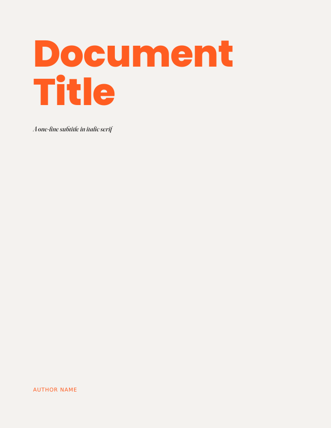
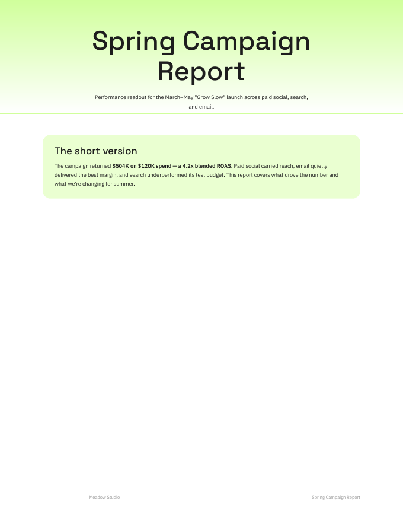
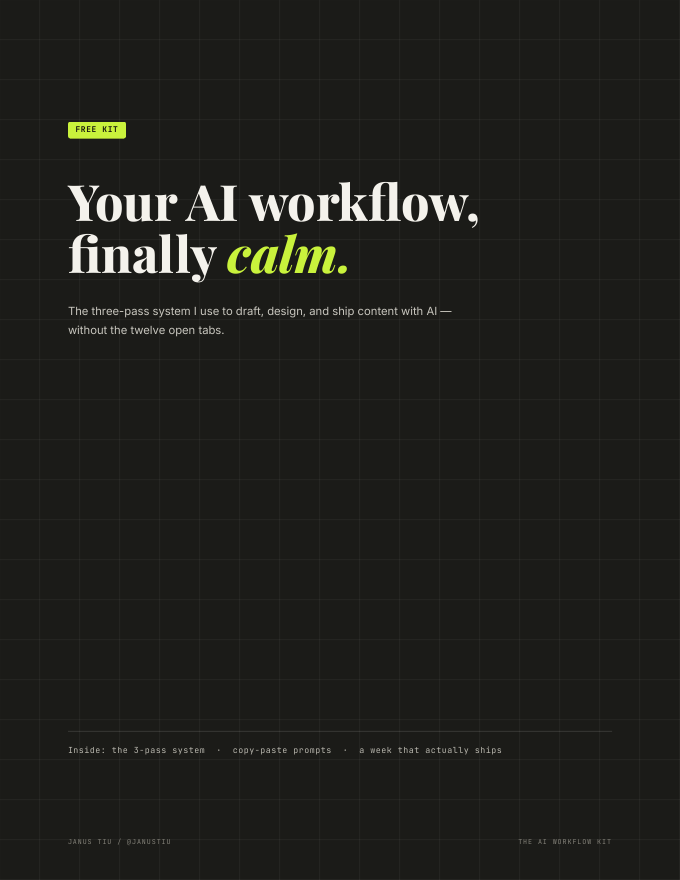
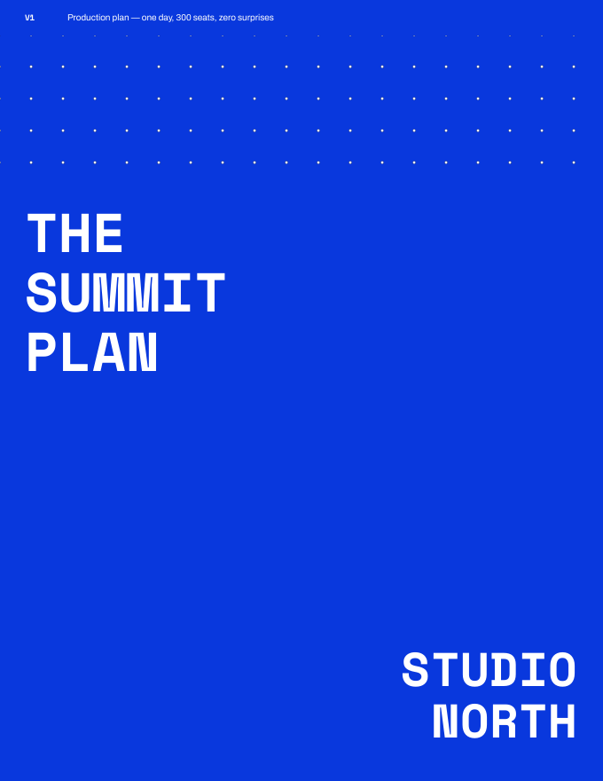
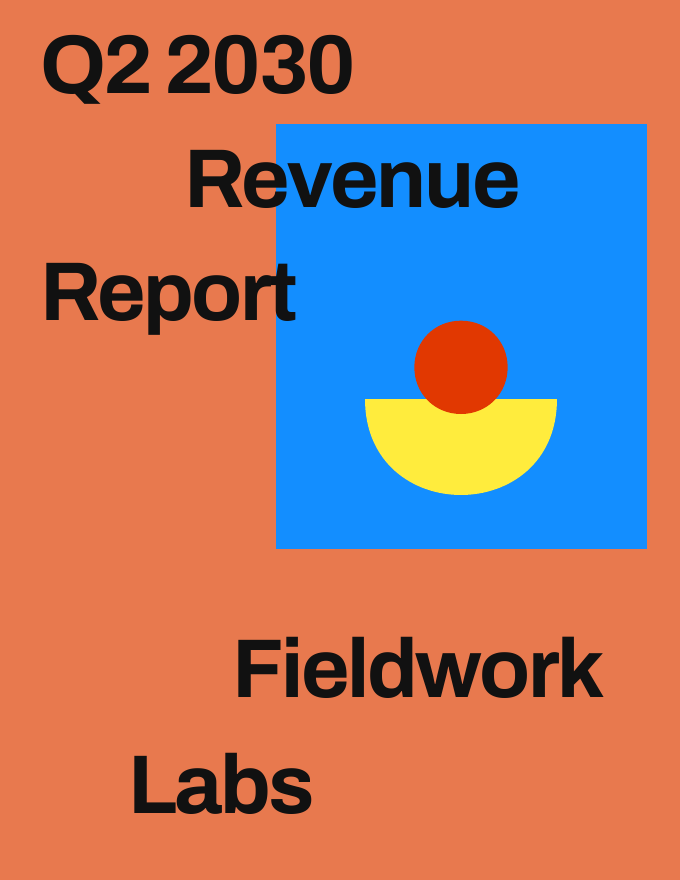

# pdf-design-skill

A Claude skill that turns your content into beautifully designed, multi-page PDFs — reports, guides, plans, audits, kits — in one of five named visual styles. Pick your style, hand Claude your content, get a document that looks art-directed.

Made by [@janustiu](https://instagram.com/janustiu).

## Pick your style

| | |
|---|---|
| <br>**editorial** — warm paper, vermilion + powder blue, serif italics. For travel guides, brand docs, anything expressive. | <br>**soft** — white space, pastel green cards, friendly grotesque. For proposals, onboarding, wellness content. |
| <br>**noir** — charcoal grid, lime accents, Playfair headlines. For kits, playbooks, bold personal-brand freebies. | <br>**blueprint** — one royal blue, mono type, hand-sketched diagrams. For frameworks, workbooks, manifestos. |
| <br>**modern** — terracotta cover, staggered grotesque type, flat primary shapes. For guides, ebooks, punchy reports. | |

Every preview above is a real document the skill produced — open the full PDFs in [`examples/`](examples/): a travel guide (editorial), a marketing report (soft), a creator freebie kit (noir), an event production plan (blueprint), and a revenue report (modern).

## What it does

Every style supports the same components, each with its own visual treatment:

- Data tables, to-do lists, stat rows, numbered steps, timelines
- Charts (bar, donut, line) drawn as clean SVG — no chart libraries, no screenshots
- Rule-based spot illustrations: Claude reads your text, picks a visual metaphor, and draws it in the style's shape vocabulary
- Your images, placed into the layout by content — or shape compositions when you have none

Claude asks for your content, style pick, and author line, shows you a draft of the cover and one page before building everything, and keeps the source file so you can request edits without starting over.

## Install

You need a paid Claude plan with **Code execution & file creation** enabled (Settings → Capabilities).

**Claude desktop app / Cowork:** download `pdf-design-skill.skill` from [Releases](../../releases), drag it into a Claude chat, and click **Save skill**.

**Claude.ai (web):** download the `.skill` file, rename it to `.zip`, then go to **Settings → Capabilities → Skills → Upload skill** and select it. (The zip must contain the `pdf-design-skill` folder at its root — the release file already does.)

**Claude Code:** unzip into your skills folder:

```
unzip pdf-design-skill.skill -d ~/.claude/skills/
```

## Use it

Just ask, naming a style if you have a preference:

> "Make my Q2 report as a designed PDF in the noir style"

> "Turn this checklist into a guide, blueprint style"

> "Design this properly — you pick the style"

## How it's built

```
pdf-design-skill/
├── SKILL.md                  # the brain: workflow, component contract, conventions
├── references/               # one style bible per style: tokens, rules, illustration grammar
├── assets/                   # one HTML template per style, every component demonstrated
└── scripts/setup_fonts.sh    # downloads + instances all fonts
```

Questions or requests? Find me on Instagram: [@janustiu](https://instagram.com/janustiu)
